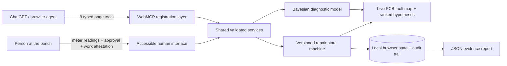

# ProbeLoop

> **Agents reason. People probe. Devices get another life.**

ProbeLoop is a WebMCP-powered repair bench where an AI agent and a person diagnose a physical device together. The agent ranks safe tests by expected information gain, focuses the shared board, updates the fault model from evidence, and stages a bounded repair. The person remains indispensable: only a person can read the meter, approve the repair, attest that physical work happened, and verify the result.


## Challenge links

- **Live application:** `LIVE_URL_PENDING`
- **Public challenge source:** `https://github.com/jackson-kuja/Audit-My-Model/tree/probeloop-webmcp-challenge`
- **Demo video:** `VIDEO_URL_PENDING`
- **Fast judge guide:** [JUDGES.md](JUDGES.md)
- **Ready-to-paste Devpost copy:** [DEVPOST.md](DEVPOST.md)

The public fixture is entirely synthetic. ProbeLoop does not connect to hardware and is not electrical-safety guidance or a repair certification product.

## Why this is a WebMCP-native experience

A chat-only agent can explain electronics, but it cannot see the meter in a person's hand. Conventional browser automation can click controls, but it has no trustworthy contract for observations, evidence thresholds, or physical authority. ProbeLoop gives the open page nine named, typed capabilities through `document.modelContext.registerTool(...)`, then deliberately withholds the two actions an agent must never impersonate: **repair approval** and **physical-work attestation**.

The result is not “AI beside a dashboard.” It is a shared evidence loop:

1. The agent reads the same case and posterior probabilities visible to the person.
2. It compares remaining tests and selects the highest-information, low-risk measurement.
3. The page highlights the exact board location and probe points.
4. A person performs the test and reports the result.
5. The agent records that human-attributed observation; ProbeLoop recomputes the diagnosis.
6. When the evidence threshold is met, the agent stages one predefined repair.
7. A person reviews and approves the exact plan in the page. No approval tool exists.
8. A person attests that the physical repair was completed with power disconnected.
9. The agent records the person's post-repair observations and returns an auditable report.

Every state-changing tool requires the current visible case version, so stale calls fail closed. Every successful transition updates the same interface the person is viewing.

## 60-second judge lane

Open the live site in ChatGPT's built-in browser or a WebMCP-capable Chromium build, then use this prompt:

> Diagnose this speaker using the safest most informative test. Show me exactly where to probe, record only the result I report, then stage the evidence-supported repair for my approval. Never claim you performed the physical work.

Expected flow:

1. The agent calls `get_case_state` and `recommend_next_test`.
2. It selects `f1_continuity`; the page highlights both F1 pads.
3. Report: **“I measured OPEN / OL with USB disconnected.”**
4. The posterior for an open F1 rises from 36.0% to 89.7%.
5. The agent stages `replace_f1` and stops at the visible approval gate.
6. Click **Approve this exact plan**, then check both physical-completion attestations.
7. Report: **“I observed normal startup and charging.”**
8. The case reaches `RESOLVED` at version 7 and exports a provenance-rich JSON report.

A normal browser can exercise the identical validated handlers through **Agent rehearsal**; WebMCP support is not required to inspect the complete product.

## Site tools

| Tool | Effect | Purpose |
| --- | --- | --- |
| `get_case_state` | Read only | Returns version, phase, diagnosis, evidence, repair, and verification state. |
| `list_safe_tests` | Read only | Ranks remaining fixture tests by expected information gain. |
| `recommend_next_test` | Read only | Returns the single best next measurement and a human-facing reason. |
| `focus_component` | Visible state | Focuses one known component on the shared board. |
| `select_test` | Visible state | Reveals exact probe instructions and board points. |
| `record_measurement` | Evidence write | Records only a human-attributed result with the power boundary confirmed. |
| `stage_repair_plan` | Proposal write | Stages one predefined, confidence-gated repair for human review. |
| `record_post_repair_check` | Evidence write | Records human-observed startup and charging results. |
| `get_case_report` | Read only | Returns a concise, attributable evidence report. |

There is intentionally **no** `approve_repair`, `perform_repair`, arbitrary DOM, JavaScript, selector, network-fetch, or audit-deletion tool.

## Architecture



The implementation is a top-level, dependency-free ES-module application:

- `src/data.js` — synthetic board, hypotheses, test likelihoods, and bounded repair catalog.
- `src/domain.js` — entropy/information-gain math, Bayesian updates, invariants, state transitions, and report generation.
- `src/tools.js` — nine closed JSON Schemas, concise outputs, annotations, and shared handlers.
- `src/webmcp.js` — `document.modelContext.registerTool` registration with `AbortSignal` lifecycle cleanup.
- `src/app.js` — human interface, fallback agent console, accessible interactions, export, and persistence.
- `tests/` — deterministic domain, security-boundary, output-budget, and lifecycle tests.
- `scripts/browser_verify.py` — real Chromium release gate using the exact registered tool functions.

Read [docs/ARCHITECTURE.md](docs/ARCHITECTURE.md) for the full trust-boundary design.

## Run locally

Requirements: Python 3 or any static server. Node.js 20+ is needed only for the automated tests.

```bash
python3 -m http.server 4173
# open http://localhost:4173
```

Or:

```bash
npm run serve
```

No install step, account, API key, backend, database, cookie, or network request is required.

### Test with WebMCP

Use ChatGPT's current desktop built-in browser or a Chromium build with the WebMCP experiment enabled. The header changes from **9 tools · rehearsal mode** to **9 site tools available** when registration succeeds.

The integration follows the current imperative API:

```js
const controller = new AbortController();
await document.modelContext.registerTool(tool, { signal: controller.signal });
// Later: controller.abort();
```

## Verification

```bash
npm test                 # 18 deterministic unit/contract tests
npm run verify           # static release checks + full Node test suite
python3 scripts/browser_verify.py
```

The browser gate starts a clean static server, mocks the browser's `document.modelContext`, captures all nine actual registrations, executes the golden workflow through those registered functions, crosses the two human-only checkpoints through visible controls, verifies persistence and export, checks basic structural accessibility, and tests the mobile layout.

See [docs/EVALUATION.md](docs/EVALUATION.md) for the complete coverage map and the 24 prompt-to-tool/no-tool contract cases.

## Safety and privacy boundaries

- Synthetic low-voltage board and fictional device only.
- No hardware control, image upload, microphone, camera, external API, analytics, authentication, or personal data.
- Closed schemas plus domain-layer validation; schemas are guidance, code is the enforcement boundary.
- Free text is limited and marked with `untrustedContentHint` where applicable.
- Read-only tools carry `readOnlyHint`.
- Exact current versions are required for every state change.
- Human approval and physical-work attestation have no WebMCP equivalent.
- Local state can be reset from the header; reports are generated locally.

Read [SECURITY.md](SECURITY.md) for details.

## Potential impact

The world generated 62 billion kg of e-waste in 2022, while 22.3% was documented as formally collected and recycled; the UN's Global E-waste Monitor projects 82 billion kg by 2030. ProbeLoop's long-term product thesis is that repair guidance becomes more trustworthy when agent inference and human physical evidence share one explicit, auditable state—not when an agent merely produces more instructions. Source: [UNITAR / ITU, *Global E-waste Monitor 2024*](https://unitar.org/about/news-stories/press/global-e-waste-monitor-2024-electronic-waste-rising-five-times-faster-documented-e-waste-recycling).

The pattern generalizes beyond electronics to bicycle maintenance, appliance triage, lab work, field inspection, and any workflow where the agent can reason but the person must safely touch reality.

## Challenge-period declaration

ProbeLoop's product concept, synthetic fixture, diagnostic model, WebMCP tool surface, human-authority gates, interface, tests, screenshots, documentation, and demo assets were created for the OpenAI WebMCP Challenge during its official build period beginning August 25, 2026. The repository history identifies the challenge release explicitly.

## License

MIT © 2026 Jackson Kuja. See [LICENSE](LICENSE). Original inline SVG artwork and interface assets are included under the same license. Third-party notices are in [THIRD_PARTY_NOTICES.md](THIRD_PARTY_NOTICES.md).
