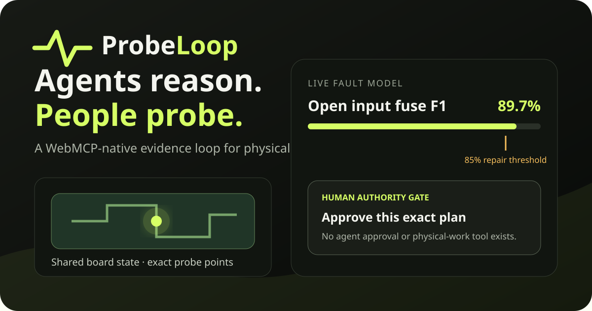

# ProbeLoop

<p align="center"></p>

> **Agents reason. People probe. Devices get another life.**

ProbeLoop is a WebMCP-native repair bench where an AI agent and a person diagnose a physical device together. The agent ranks safe tests by expected information gain, focuses the shared board, updates the fault model from evidence, and stages a bounded repair. The person remains indispensable: only a person can read the meter, approve the plan, attest that physical work happened, and verify the result.

## Judge links

- **Live application:** https://rawcdn.githack.com/jackson-kuja/Audit-My-Model/ac809e7f2795bc2ad359781e935423345041a473/index.html
- **Public source:** https://github.com/jackson-kuja/Audit-My-Model/tree/probeloop-webmcp-challenge
- **Narrated demo:** 2:25 upload-ready MP4 in the submission handoff; the account-managed YouTube URL belongs in the challenge form.
- **60-second judge guide:** [JUDGES.md](JUDGES.md)
- **Ready-to-paste submission copy:** [DEVPOST.md](DEVPOST.md)

The public fixture is entirely synthetic. ProbeLoop does not connect to hardware and is not electrical-safety guidance or a repair certification product.

## Why this must be WebMCP

A chat-only agent can explain electronics, but it cannot see the meter in a person's hand. Conventional browser automation can click controls, but it has no trustworthy contract for observations, evidence thresholds, or physical authority. ProbeLoop gives the top-level page nine narrow, typed capabilities through `document.modelContext.registerTool(...)`, while intentionally withholding the two actions an agent must never impersonate: **repair approval** and **physical-work attestation**.

The shared evidence loop is visible to both participants:

1. The agent reads the same case and posterior probabilities visible to the person.
2. It selects the highest-information low-risk test; the page highlights the exact board pads.
3. A person performs the test and reports the result.
4. ProbeLoop records that human-attributed observation and recomputes the diagnosis.
5. The agent may stage one predefined repair only after the 85% evidence threshold is crossed.
6. A person reviews and approves the exact plan, then separately attests that the physical repair occurred with power disconnected.
7. The agent records the person's post-repair observations and returns an auditable report.

Every state-changing tool requires the current visible case version, so stale calls fail closed. Every successful transition updates the same interface the person is viewing.

## 60-second judge lane

Open the live app in ChatGPT's built-in browser or another WebMCP-capable Chromium build and ask:

> Diagnose this speaker using the safest most informative test. Show me exactly where to probe, record only the result I report, then stage the evidence-supported repair for my approval. Never claim you performed the physical work.

Expected path: `get_case_state` → `recommend_next_test` → `select_test(f1_continuity)` → the person reports **OPEN / OL with USB disconnected** → `record_measurement` raises open-F1 confidence from 36.0% to 89.7% → `stage_repair_plan(replace_f1)` → the agent stops at the human gate → the person approves and completes both attestations → the person reports normal startup and charging → `record_post_repair_check` resolves the case at version 7.

A normal browser can exercise the identical validated handlers through **Agent rehearsal**, so judges can inspect the complete product even without a WebMCP-enabled browser.

## Site-tool surface

| Tool | Role |
| --- | --- |
| `get_case_state` | Read the bounded, versioned case state. |
| `list_safe_tests` | Rank remaining synthetic tests by information gain. |
| `recommend_next_test` | Return the best low-risk next measurement. |
| `focus_component` | Focus a known component on the shared board. |
| `select_test` | Reveal exact instructions and probe points. |
| `record_measurement` | Record only a human-attributed result with the power boundary confirmed. |
| `stage_repair_plan` | Stage one confidence-gated repair for human review. |
| `record_post_repair_check` | Record human-observed startup and charging results. |
| `get_case_report` | Return an attributable evidence report. |

There is deliberately **no** `approve_repair`, `perform_repair`, arbitrary-DOM, JavaScript, selector, network-fetch, or audit-deletion tool.

## Architecture and trust boundaries

The dependency-free ES-module app has one service layer shared by the visible interface and all WebMCP handlers:

- `src/domain.js` — entropy/information-gain math, Bayesian updates, invariants, state transitions, and reports.
- `src/tools.js` — nine closed JSON Schemas, bounded outputs, annotations, and shared handlers.
- `src/webmcp.js` — direct top-level registration with `AbortSignal` lifecycle cleanup.
- `src/app.js` — accessible human controls, fallback agent console, export, and persistence.
- `tests/` and `evals/` — deterministic behavior, authority-boundary, output-budget, lifecycle, and prompt-to-tool/no-tool cases.

Mutating calls require `expected_version`. Free text is limited and marked as untrusted. Read tools carry `readOnlyHint`. Human approval and physical-work attestation have no WebMCP equivalent. See [docs/ARCHITECTURE.md](docs/ARCHITECTURE.md) and [SECURITY.md](SECURITY.md).

## Run and verify

```bash
python3 -m http.server 4173
# open http://localhost:4173
```

No install step, account, API key, backend, database, cookie, or external request is required for the judge path. Node.js 20+ is needed only for automated checks.

```bash
npm test                         # 18 deterministic unit/contract tests
npm run verify                   # static release checks + full Node suite
python3 scripts/browser_verify.py # complete Chromium v1→v7 journey
```

The browser gate captures the nine actual registrations, invokes their bound handlers, crosses the two human-only checkpoints through visible controls, verifies persistence and JSON export, checks structural accessibility, and exercises the mobile layout. A separate hosted Chromium workflow verifies the immutable public URL and its assets.

## Impact and scope

ProbeLoop demonstrates a reusable pattern for work where an agent can reason but a person must safely touch reality: electronics repair, bicycle maintenance, appliance triage, lab work, and field inspection. The product thesis is that physical-world assistance becomes trustworthy when machine inference and human evidence share one explicit, reversible, auditable state—not when an agent merely produces more instructions.

## Challenge-period declaration

The synthetic fixture, diagnostic model, WebMCP surface, human-authority gates, interface, tests, documentation, and demo assets were created for the OpenAI WebMCP Challenge during its official build period beginning August 25, 2026.

## License

MIT © 2026 Jackson Kuja. See [LICENSE](LICENSE). Original interface artwork is included under the same license; third-party notices are in [THIRD_PARTY_NOTICES.md](THIRD_PARTY_NOTICES.md).
